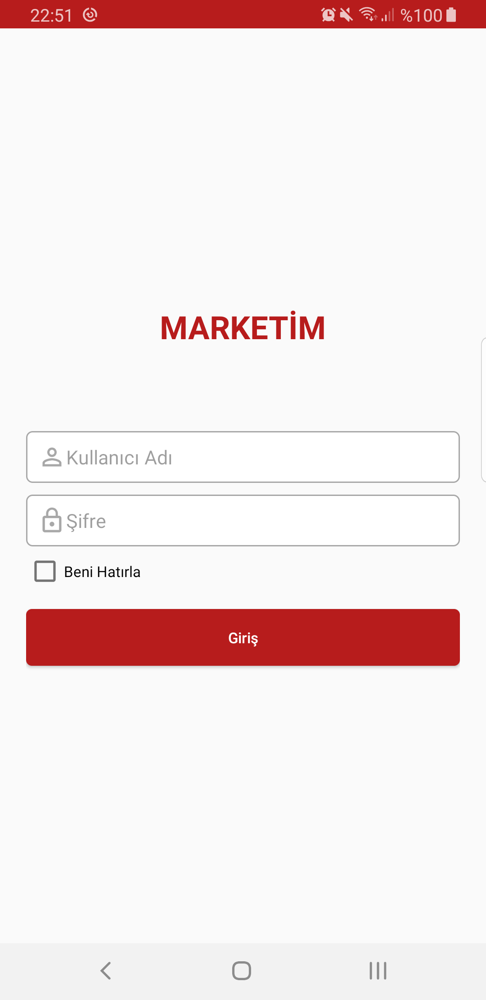
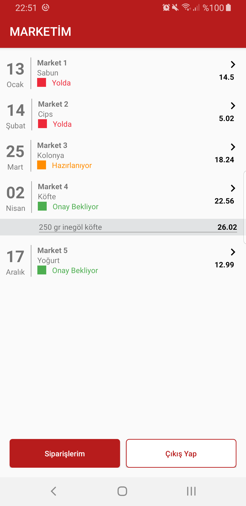
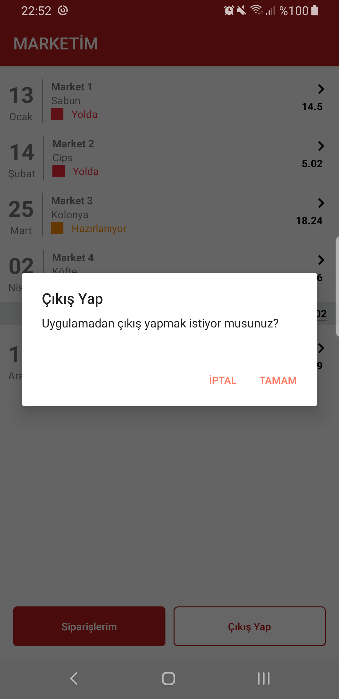

This sample android applicatoin created for Android Tech Challenge

you could also check my other projects and blog:
- https://github.com/gturedi/StatefulLayout
- https://github.com/gturedi/nytimes-api-sample
- http://gturedi.blogspot.com/

used libraries:
- okhttp: to handle http requests
- gson: for parsing json reponse
- timber: for logging
- androidx lifecycle: to implement mvvm pattern

screenshoots of app:

